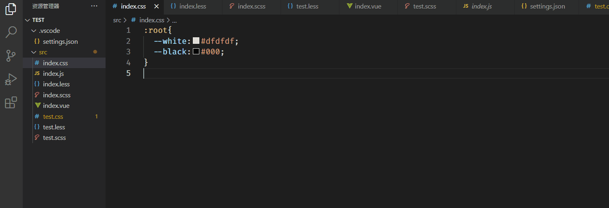

# css-var-hint README

For the variables in the configured file, prompt the variables in the supported files

Select the corresponding text and click the small light bulb to replace the style

对配置的文件内变量，在支持的文件中进行变量提示

选中对应文本点击小灯泡进行样式的替换

## Features
The supported prompt files are as follows

支持的提示文件如下

css


scss


less


vue


replace style


## Extension Settings
If you want to use the extension, you must add the `.vscode/settings.json` file in the workspace

And add `cssVarHint.files` property, `cssVarHint.files` is an array, receiving `.css` `.less` `scss` file path

如果想要使用该插件，就必须在工作区中添加`.vscode/settings.json`文件

并且添加`cssVarHint.files`属性，`cssVarHint.files`是一个数组，接收`.css` `.less` `scss`文件路径


```json
{
  "cssVarHint.files": [
    "src/index.css",
    "src/index.less",
    "src/index.scss"
  ]
}

```
